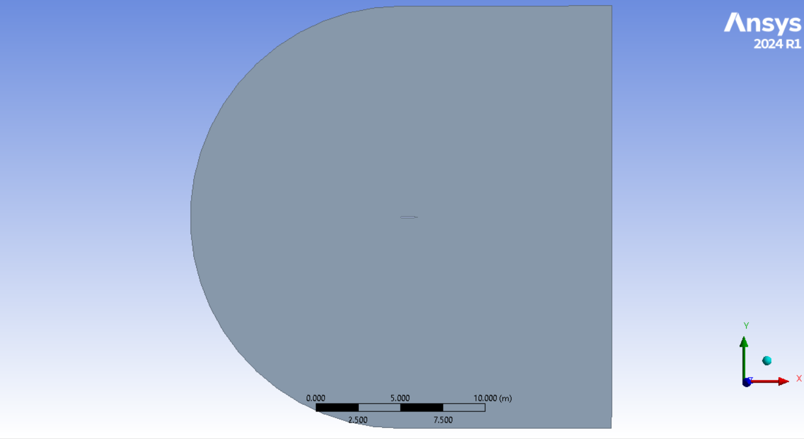
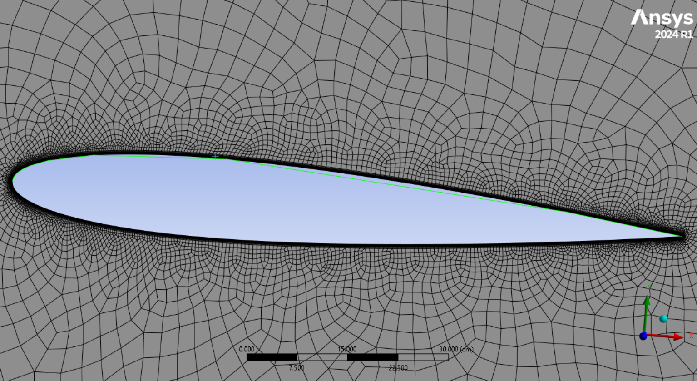
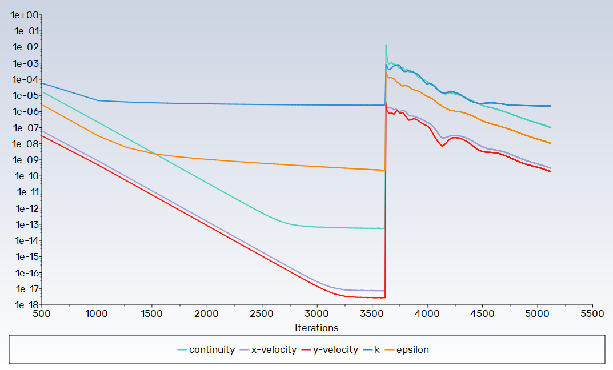
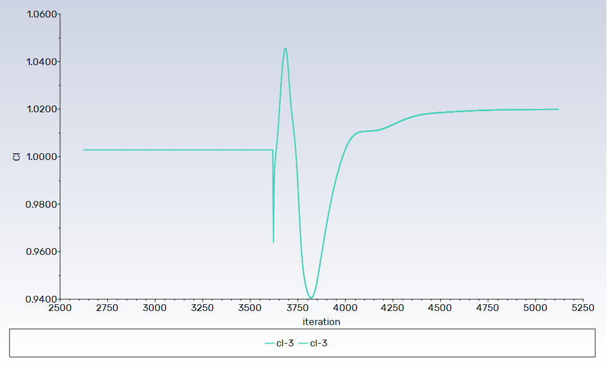
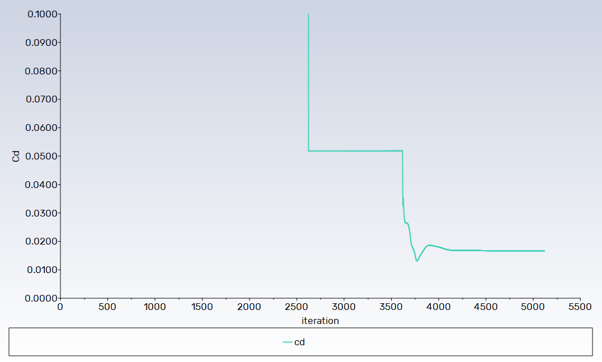
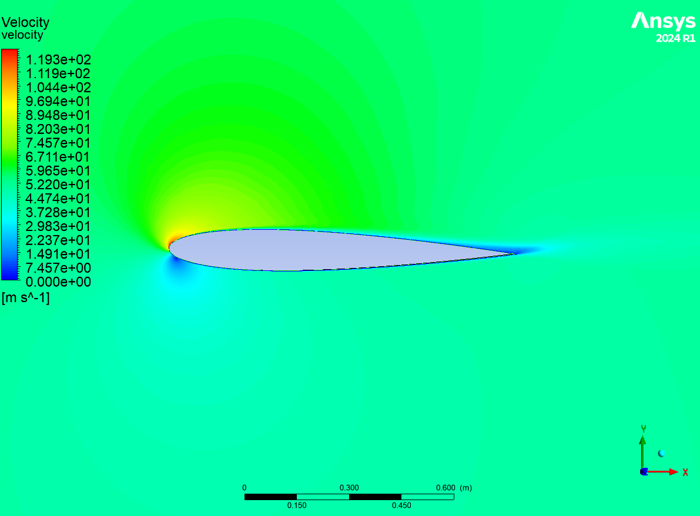
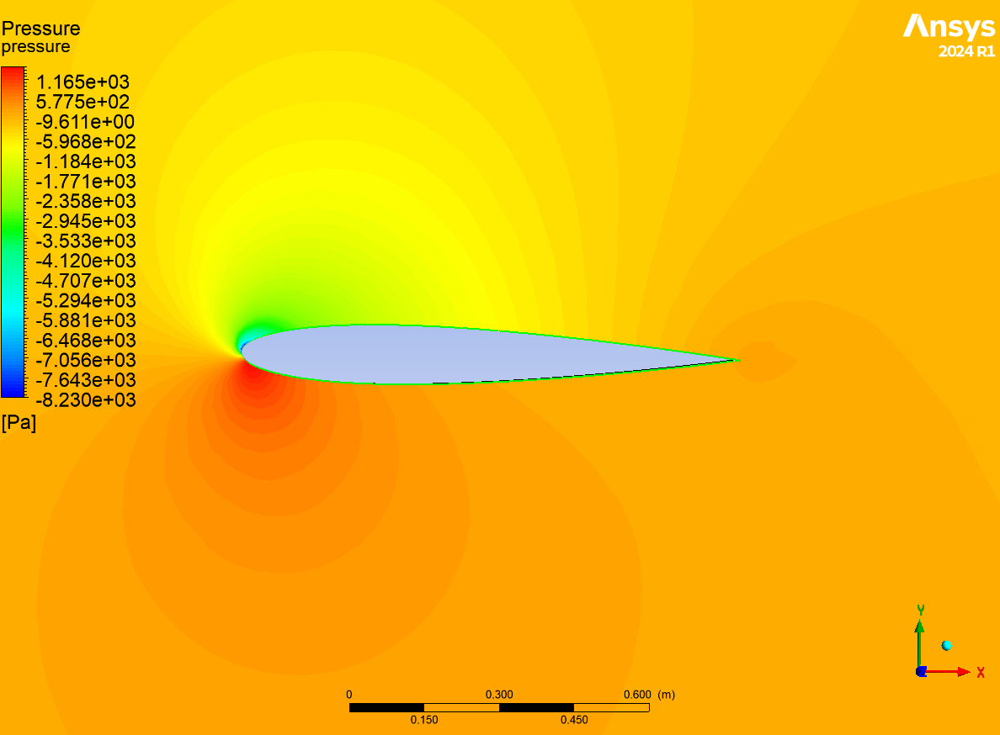
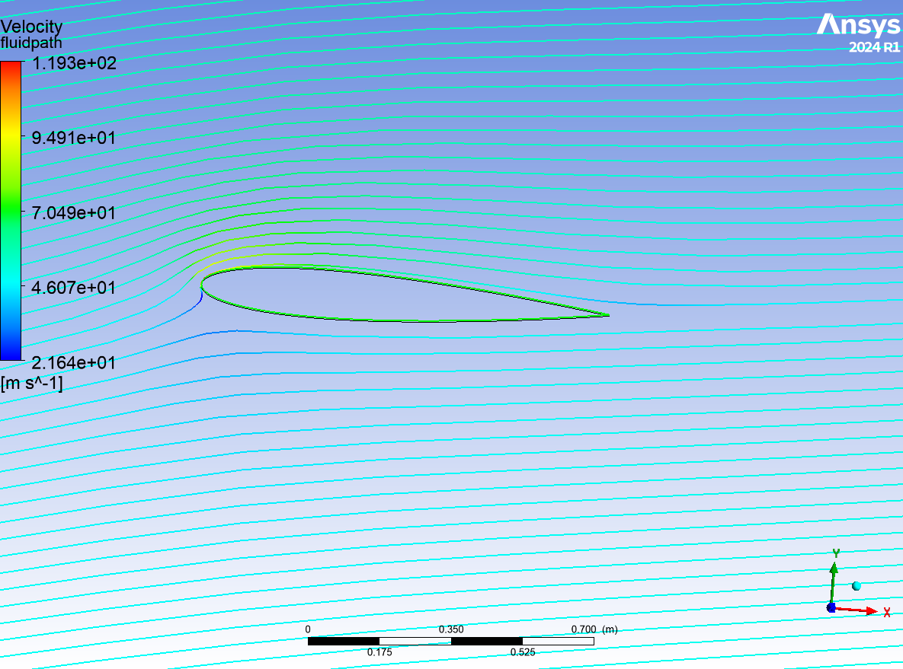
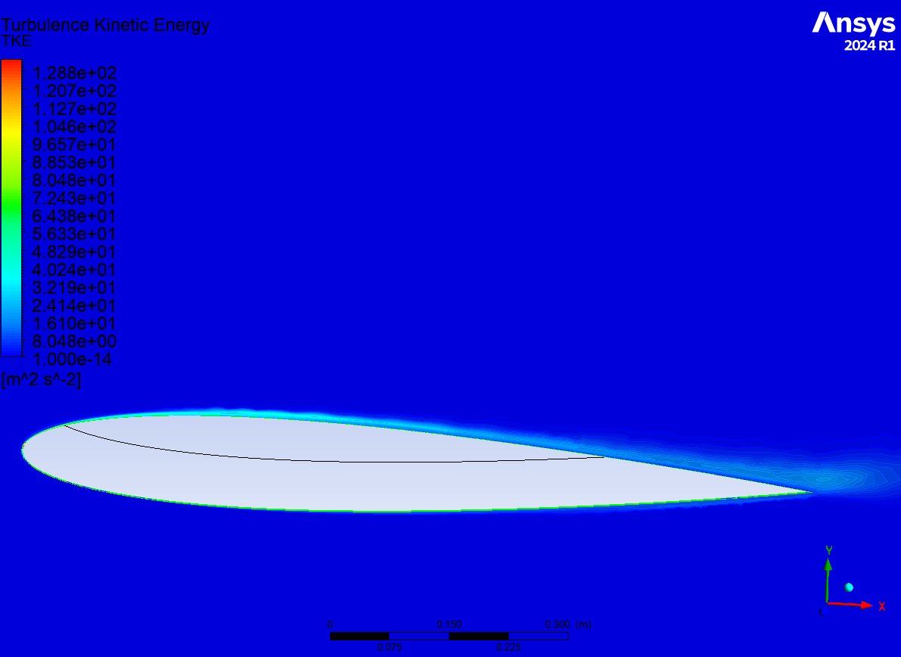
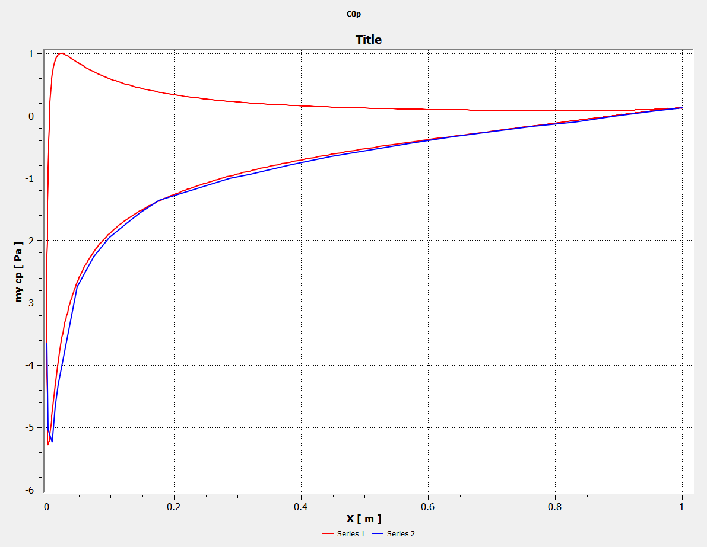

# Turbulent Airfoil Flow Simulation | ANSYS Fluent

## Overview

A 2D CFD study of turbulent flow over a NACA 0012 airfoil using ANSYS Fluent.
The simulation investigates the aerodynamic behavior of the airfoil at an angle
of attack of 10° and evaluates its aerodynamic performance through pressure,
velocity, lift, and drag characteristics.

The project is based on a canonical turbulent airfoil-flow problem from
Cornell University's engineering simulation coursework, with emphasis on
CFD setup, turbulence modeling, numerical solution, post-processing, and
validation against experimental data.

## Problem Definition

The flow around a NACA 0012 airfoil is simulated at an angle of attack of 10°.
The resulting flow field and aerodynamic coefficients are analyzed and compared
with experimental data.

### Operating Conditions

| Parameter | Value |
|---|---:|
| Airfoil | NACA 0012 |
| Chord length | 1 m |
| Angle of attack | 10° |
| Free-stream velocity | 51.45 m/s |
| Density | 1.1767 kg/m³ |
| Reynolds number | 6 × 10⁶ |

## Objectives

- Set up a 2D turbulent external-flow simulation in ANSYS Fluent.
- Analyze velocity and pressure fields around the NACA 0012 airfoil.
- Evaluate turbulent flow characteristics using turbulent kinetic energy.
- Obtain the surface pressure coefficient distribution.
- Determine the lift and drag coefficients.
- Compare the numerical pressure distribution with experimental data.

## CFD Methodology

The simulation follows a standard external-aerodynamics CFD workflow:

1. NACA 0012 geometry preparation
2. Computational-domain definition
3. Mesh generation and near-airfoil refinement
4. Definition of fluid properties and boundary conditions
5. Turbulence-model selection
6. Numerical solution using ANSYS Fluent
7. Convergence monitoring
8. Flow-field and aerodynamic post-processing
9. Comparison with experimental data

## Computational Domain and Mesh

The computational domain was constructed around the NACA 0012 airfoil
to represent external flow conditions. Mesh refinement was applied in
the vicinity of the airfoil to better resolve the strong flow gradients
and near-wall region.

### Computational Domain

### Near-Airfoil Mesh

## Boundary Conditions

The computational domain was configured using a velocity inlet, pressure
outlet, and no-slip wall boundaries.

| Boundary | Type |
|---|---|
| `farfield1` | Velocity inlet |
| `farfield2` | Pressure outlet |
| `lower` | Wall |
| `upper` | Wall |

### Inlet Conditions

The free-stream velocity was specified using velocity components corresponding
to a magnitude of 51.45 m/s at an angle of attack of 10°.

| Parameter | Value |
|---|---:|
| X-velocity | 50.668 m/s |
| Y-velocity | 8.934 m/s |
| Turbulent intensity | 5% |
| Turbulent viscosity ratio | 10 |

## Solver Setup

| Setting | Configuration |
|---|---|
| Solver | ANSYS Fluent |
| Dimension | 2D |
| Flow | Turbulent |
| Analysis | Steady-state |
| Turbulence model | Realizable k-ε |
| Pressure-velocity coupling | SIMPLE |
| Gradient | Least Squares Cell Based |

### Numerical Discretization

| Variable | Scheme |
|---|---|
| Pressure | Second Order |
| Momentum | Second Order Upwind |
| Turbulent Kinetic Energy | First Order Upwind |
| Turbulent Dissipation Rate | First Order Upwind |

The SIMPLE pressure-velocity coupling scheme was used to solve the
pressure-velocity field, with second-order discretization for pressure
and momentum and first-order upwind discretization for the turbulence
transport equations.

## Results

### Convergence

The convergence behavior was monitored using the residual history together
with the lift and drag coefficient histories.

### Flow Field

The velocity and pressure contours show the flow acceleration, pressure
variation, and wake development around the airfoil.

### Velocity Vectors

The velocity-vector field provides a visual representation of the flow
direction and wake structure around the airfoil.

### Turbulent Kinetic Energy

The turbulent kinetic energy distribution illustrates the regions of
increased turbulence intensity around the airfoil and in the wake.

### Particle Path

Particle paths are used to visualize the overall flow pattern and wake
development downstream of the airfoil.

## Aerodynamic Performance

The final CFD solution produced approximately:

| Quantity | CFD Result |
|---|---:|
| Lift coefficient, $C_L$ | ~1.03 |
| Drag coefficient, $C_D$ | ~0.017 |

The aerodynamic coefficients were obtained using reference values computed
from the `farfield1` inlet condition.

## Surface Pressure Coefficient Validation

The surface pressure coefficient ($C_p$) distribution obtained from the
CFD solution was compared with experimental data for the NACA 0012 airfoil.

The comparison provides a validation of the predicted pressure distribution
over the airfoil surface.

## Key Observations

- The turbulent flow field around the NACA 0012 airfoil was successfully
  obtained using ANSYS Fluent.
- Significant velocity and pressure variations occur around the airfoil
  due to the aerodynamic loading.
- The wake region develops downstream of the airfoil.
- The final aerodynamic coefficients were approximately $C_L = 1.03$
  and $C_D = 0.017$.
- The computed surface pressure coefficient distribution was compared
  with experimental data to assess the CFD prediction.

## Skills Demonstrated

- Computational Fluid Dynamics (CFD)
- ANSYS Fluent
- External Aerodynamics
- Turbulence Modeling
- Mesh Generation
- Boundary Condition Setup
- Numerical Methods
- CFD Post-processing
- Aerodynamic Force Analysis
- Experimental Validation

## Software

- ANSYS Fluent
- ANSYS Workbench
- ANSYS Meshing

## Reference

Cornell University, ENGR2000X — A Hands-on Introduction to Engineering
Simulations, Module 5: Turbulence.

Experimental data used for validation: NASA experimental data for the
NACA 0012 airfoil.
